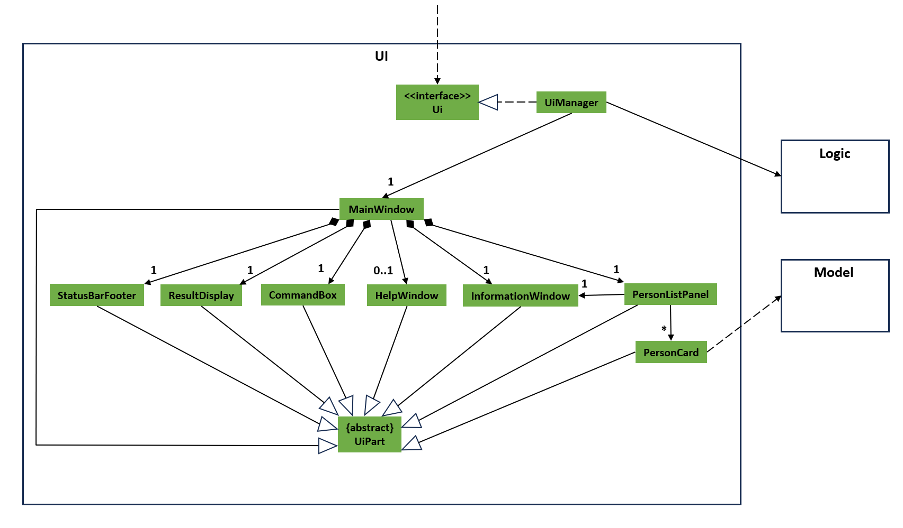
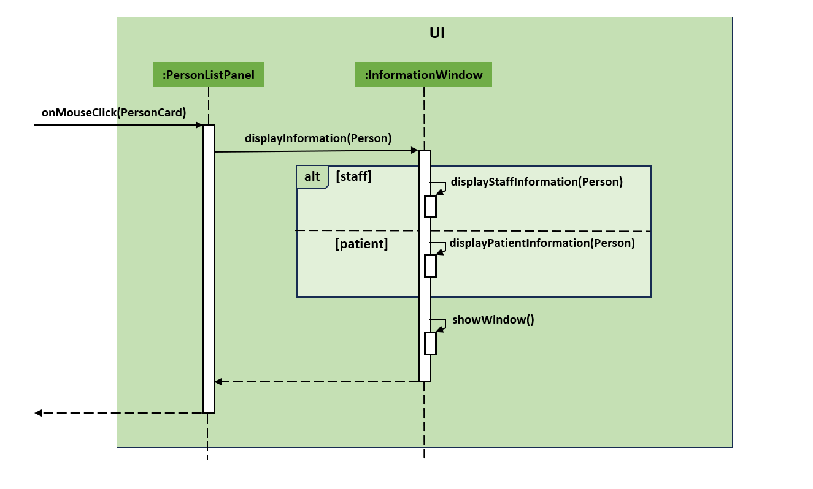
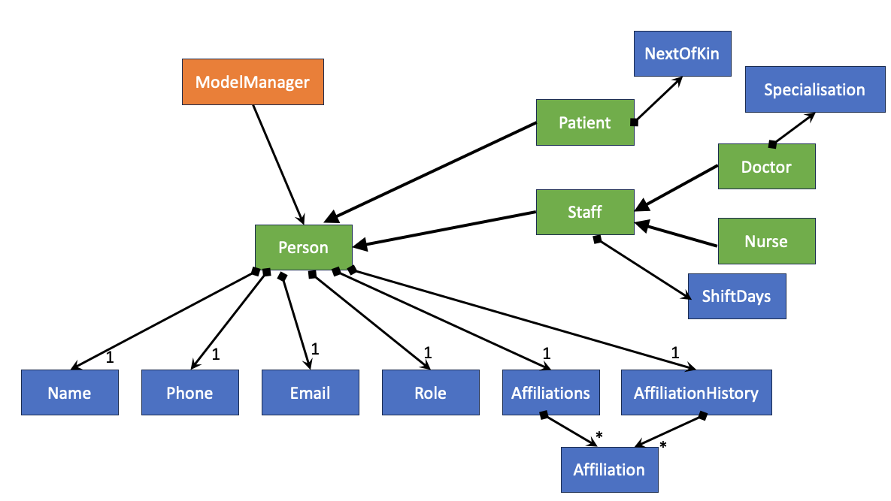
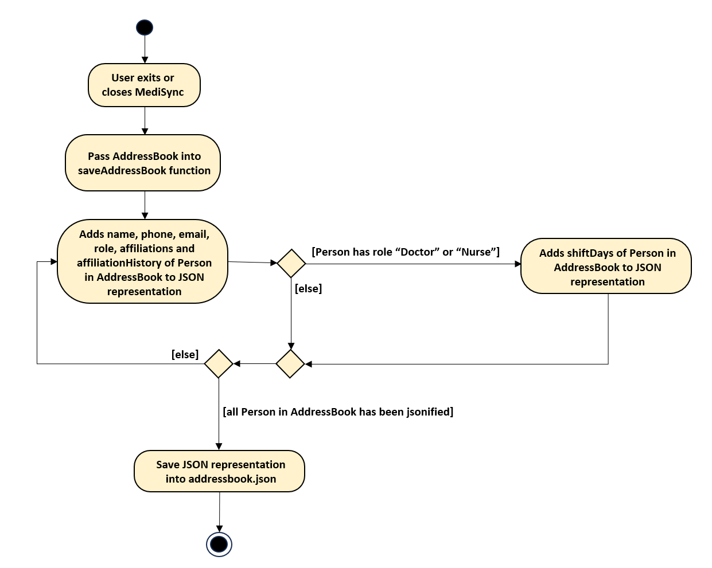
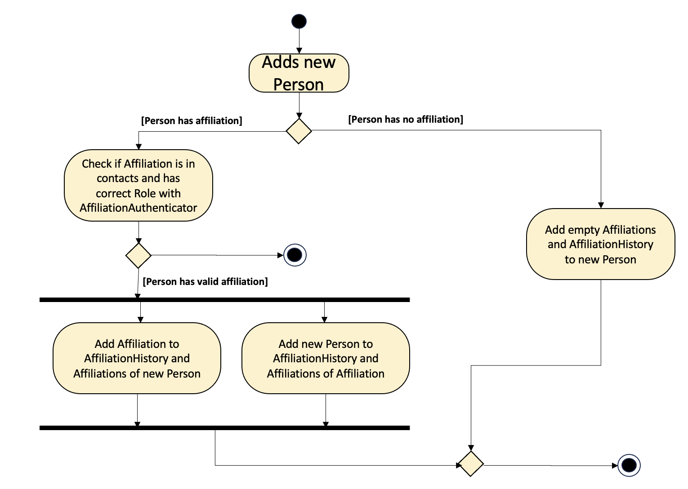

# MediSync Developer Guide

<!-- * Table of Contents -->
<page-nav-print />

--------------------------------------------------------------------------------------------------------------------

## **Acknowledgements**

This project is based on and built up upon the AddressBook-Level3 project created by the [SE-EDU initiative](https://se-education.org).

--------------------------------------------------------------------------------------------------------------------

## **Setting up, getting started**

Refer to the guide [_Setting up and getting started_](SettingUp.md).

--------------------------------------------------------------------------------------------------------------------

## **Design**

### Architecture

<puml src="diagrams/ArchitectureDiagram.puml" width="280" />

The ***Architecture Diagram*** given above explains the high-level design of the App.

Given below is a quick overview of main components and how they interact with each other.

**Main components of the architecture**

**`Main`** (consisting of classes [`Main`](https://github.com/se-edu/addressbook-level3/tree/master/src/main/java/seedu/address/Main.java) and [`MainApp`](https://github.com/se-edu/addressbook-level3/tree/master/src/main/java/seedu/address/MainApp.java)) is in charge of the app launch and shut down.
* At app launch, it initializes the other components in the correct sequence, and connects them up with each other.
* At shut down, it shuts down the other components and invokes cleanup methods where necessary.

The bulk of the app's work is done by the following four components:

* [**`UI`**](#ui-component): The UI of the App.
* [**`Logic`**](#logic-component): The command executor.
* [**`Model`**](#model-component): Holds the data of the App in memory.
* [**`Storage`**](#storage-component): Reads data from, and writes data to, the hard disk.

[**`Commons`**](#common-classes) represents a collection of classes used by multiple other components.

**How the architecture components interact with each other**

The *Sequence Diagram* below shows how the components interact with each other for the scenario where the user issues the command `delete 1`.

<puml src="diagrams/ArchitectureSequenceDiagram.puml" width="574" />

Each of the four main components (also shown in the diagram above),

* defines its *API* in an `interface` with the same name as the Component.
* implements its functionality using a concrete `{Component Name}Manager` class (which follows the corresponding API `interface` mentioned in the previous point.

For example, the `Logic` component defines its API in the `Logic.java` interface and implements its functionality using the `LogicManager.java` class which follows the `Logic` interface. Other components interact with a given component through its interface rather than the concrete class (reason: to prevent outside component's being coupled to the implementation of a component), as illustrated in the (partial) class diagram below.

<puml src="diagrams/ComponentManagers.puml" width="300" />

The sections below give more details of each component.

### UI component

The **API** of this component is specified in [`Ui.java`](https://github.com/AY2324S1-CS2103-T16-2/tp/blob/master/src/main/java/seedu/address/ui/Ui.java)

The UI consists of a `MainWindow` that is made up of parts e.g.`CommandBox`, `ResultDisplay`, `PersonListPanel`, `Information Window`, `StatusBarFooter` etc. All these, including the `MainWindow`, inherit from the abstract `UiPart` class which captures the commonalities between classes that represent parts of the visible GUI.

The `UI` component uses the JavaFx UI framework. The layout of these UI parts are defined in matching `.fxml` files that are in the `src/main/resources/view` folder. For example, the layout of the [`MainWindow`](https://github.com/se-edu/addressbook-level3/tree/master/src/main/java/seedu/address/ui/MainWindow.java) is specified in [`MainWindow.fxml`](https://github.com/se-edu/addressbook-level3/tree/master/src/main/resources/view/MainWindow.fxml)

The `UI` component,

* executes user commands using the `Logic` component.
* listens for changes to `Model` data so that the UI can be updated with the modified data.
* keeps a reference to the `Logic` component, because the `UI` relies on the `Logic` to execute commands.
* depends on some classes in the `Model` component, as it displays `Person` object residing in the `Model`.

The interaction between `PersonListPanel` and `InformationWindow` is bridged by an on-click event.

The sequence diagram below illustrates the interactions between `PersonListPanel` and `InformationWindow` when the user clicks on a displayed `Person`.

### Logic component

**API** : [`Logic.java`](https://github.com/se-edu/addressbook-level3/tree/master/src/main/java/seedu/address/logic/Logic.java)

Here's a (partial) class diagram of the `Logic` component:

<puml src="diagrams/LogicClassDiagram.puml" width="550"/>

How the `Logic` component works:

1. When `Logic` is called upon to execute a command, it is passed to an `AddressBookParser` object.
   1. If the command has arguments, the `AddressBookParser` creates a parser that matches the command (e.g., `XYZCommandParser`) and uses it to parse the command.
   1. If the command has no arguments, the `AddressBookParser` directly returns the `Command` object.
1. This results in a `Command` object (more precisely, an object of one of its subclasses e.g., `XYZCommand`) which is executed by the `LogicManager`.
1. The command can communicate with the `Model` when it is executed (e.g. to add/edit/delete a person).
1. The result of the command execution is encapsulated as a `CommandResult` object which is returned back from `Logic`.

The sequence diagram below illustrates the interactions within the `Logic` component, taking `execute("COMMAND_WORD ARGS")` as an example.

<puml src="diagrams/CommandARGSSequenceDiagram.puml" alt="Interactions Inside the Logic Component for the `COMMAND_WORD ARGS` Command" />

<box type="info" seamless>

**Note:** The lifeline for `XYZCommandParser` should end at the destroy marker (X) but due to a limitation of PlantUML, the lifeline reaches the end of diagram.
</box>

Below is a similar sequence diagram, illustrating the interactions for a command with no arguments. (e.g. `execute("COMMAND_WORD")`)

<puml src="diagrams/CommandNOARGSSequenceDiagram.puml" alt="Interactions Inside the Logic Component for the `COMMAND_WORD` Command" />

Here are the details for the actual command execution and interaction between Logic and Model for the `delete` command. Other commands involving list indexing follow similar formats.

<puml src="diagrams/DeleteCommandExecutionSequenceDiagram.puml" alt="Interactions Between Logic and Model for the `delete` Command" />

Here are the other classes in `Logic` (omitted from the class diagram above) that are used for parsing a user command:

<puml src="diagrams/ParserClasses.puml" width="600"/>

How the parsing works:
* When called upon to parse a user command, the `AddressBookParser` class creates an `XYZCommandParser` (`XYZ` is a placeholder for the specific command name e.g., `AddCommandParser`) which uses the other classes shown above to parse the user command and create a `XYZCommand` object (e.g., `AddCommand`) which the `AddressBookParser` returns back as a `Command` object.
* All `XYZCommandParser` classes (e.g., `AddCommandParser`, `DeleteCommandParser`, ...) inherit from the `Parser` interface so that they can be treated similarly where possible e.g, during testing.

### Model component
**API** : [`Model.java`](https://github.com/AY2324S1-CS2103-T16-2/tp/blob/master/src/main/java/seedu/address/model/Model.java)

<puml src="diagrams/ModelClassDiagram.puml" width="450" />

The `Model` component,

* stores the address book data i.e., all `Person` objects (which are contained in a `UniquePersonList` object).
* stores the currently 'selected' `Person` objects (e.g., results of a search query) as a separate _filtered_ list which is exposed to outsiders as an unmodifiable `ObservableList<Person>` that can be 'observed' e.g. the UI can be bound to this list so that the UI automatically updates when the data in the list change.
* stores a `UserPref` object that represents the user’s preferences. This is exposed to the outside as a `ReadOnlyUserPref` objects.
* Contain `AuthenticateAffiliation` class to validate affiliation before allow to add to a `Person` object's  affiliation. This is to prevent affiliation that is not compatible with the `Person` object to be added.
* Contain `AffiliationModifier` class to modify the affiliation of a `Person` object. This is to ensure affiliations of a `Person` object is correctly modified.
* does not depend on any of the other three components (as the `Model` represents data entities of the domain, they should make sense on their own without depending on other components)

The `Person` component has several attributes: `Name`, `Phone`, `Email`, `Role`, `Affiliations` and `AffiliationHistory`. Each instance of `Person` class has exactly one of each of these attributes. In particular, `Affiliations` and `AffiliationHistory` can have multiple `Affiliation`. 

`Patient` and `Staff` are the 2 main subclasses of `Person`. `Patient` has an additional attribute `NextOfKin`. `Staff` has an additional attribute `ShiftDays`. `Staff` is a superclass of `Doctor` and `Nurse`, where the former has an additional attribute `Specialisation`.

The `AuthenticateAffiliation` class is an integral part of our system's affiliation management. It is responsible for authenticating and validating affiliations before adding it to a `Person` affiliation. This class contains methods for checking the validity of affiliations and finding affiliated persons in the system's address book.

The `AffiliationModifier` class is a key component of our system's affiliation management. It provides methods to modify affiliations by adding, removing, or changing affiliations and affiliation history. These operations are essential for maintaining accurate and up-to-date affiliations within our system.

The hierarchical structure of the classes allows for easy extensibility. If there is a need to introduce more specialized roles or attributes in the future, they can be added as subclasses under Staff or even under Doctor and Nurse. The distinction between various classes also suggests that there can be different levels of permissions associated with each role, which can be useful when implementing data privacy and security features.

### Storage component

**API** : [`Storage.java`](https://github.com/AY2324S1-CS2103-T16-2/tp/blob/master/src/main/java/seedu/address/storage/Storage.java)

The `Storage` component,
* can save both address book data and user preference data in JSON format, and read them back into corresponding objects.
* inherits from both `AddressBookStorage` and `UserPrefStorage`, which means it can be treated as either one (if only the functionality of only one is needed).
* depends on some classes in the `Model` component (because the `Storage` component's job is to save/retrieve objects that belong to the `Model`)

Specifically, the `CustomJsonAdaptedPersonSerializer` acts as a blueprint to convert a `Person` in the `AddressBook` to its correct JSON notation based on the `Person`'s `Role`.

The following activity diagram summarizes the jsonification process of the AddressBook when a user executes the `exit` command or closes MediSync:

### Common classes

Classes used by multiple components are in the `seedu.addressbook.commons` package.

--------------------------------------------------------------------------------------------------------------------

## **Implementation**

This section describes some noteworthy details on how certain features are implemented.

### Affiliation History feature
#### Implementation
The `affiliationHistory` records the past and current affiliations that a person has with others. It is implemented similar to `affiliations`, but with a few differences:
* When adding a person, the user specified `affiliations` will be added to `affiliationHistory` of himself/herself and the affiliated person.
  * The `Person` constructor has been modified to use `affiliations` as the `affiliationHistory` during initialization.
* When editing a `Person`'s `Name`, the user specified affiliation will also be updated in `affiliationHistory` of others.
This is done by iterating through the affiliation list of the `Person` and updating the `affiliationHistory` of others. 
* When editing a `Person`'s `affiliations`, specifically,
  * adding `affiliations` will be add it to `affiliationHistory` as well
  * removing an `affiliations`, will **not** be removed from `affiliationHistory`
* When deleting a `Person`, the `affiliationHistory` of others will be updated accordingly.

Utilization of Name as a Unique Identifier:
The proposed method circumvents these issues by employing the Name field as a unique identifier for affiliations. When an affiliation is deleted, the system uses this identifier to update all relevant entries across the `affiliationHistory`, thereby maintaining consistency.

This strategy streamlines the affiliation management process, as it allows for the complete removal of a Person from the system, including their historical data. From a user's perspective, this process is more intuitive and efficient, as it aligns with the expected outcome of entirely deleting an entry from the system.

The following activity diagram showcases the process of handling affiliation when adding a person:

#### Design considerations
Alternative implementations:
#### 1. Maintaining Inactive Affiliations within Affiliation History:
One potential methodology involves keeping the deleted affiliations within the `affiliationHistory` of other entities in the system. Implementing this approach would mean that, upon the deletion of an affiliation, the system does not erase the affiliation's record. Instead, it marks it as inactive or invalid within the historical log. This could be achieved by introducing a specific indicator or flag signifying the affiliation's current status.

An extension of this method might require the system to incorporate a separate historical record or repository (`affiliationHistory`), explicitly dedicated to storing those affiliations marked as invalid. This secondary historical log ensures that while the affiliation is no longer active or valid, there is still a trace of its existence and impact on other entities within the system.

However, this strategy inherently increases the complexity of the system's infrastructure. It necessitates additional layers of logic in several functionalities, particularly those that list or display affiliations. These functions must be sophisticated enough to distinguish between active and inactive affiliations, ensuring that any representation of the data (like contact lists) reflects only the current, valid entries. This approach, while comprehensive in its historical tracking, may compromise the user experience by not fully removing deleted entities from various views and lists, potentially leading to confusion or perceived inefficiency.

#### 2. Storing Complete Person Objects:
Another alternative involves the `affiliationHistory` storing complete `Person` objects instead of just references or unique identifiers. This method is akin to taking a snapshot of the Person object at various points in time, preserving a more detailed historical account.

However, this approach can create discrepancies between the current state of `affiliations` and the historical records. Because each snapshot within the `affiliationHistory` remains static, any updates to a Person object post-creation of these snapshots would not reflect in the historical data. This inconsistency means that the current and historical views of affiliations could diverge significantly over time, potentially causing confusion or data integrity concerns.

Moreover, storing complete objects demands more storage space and could complicate data management tasks due to the volume and detail level of the data retained.

### ShiftDays feature
#### Implementation
The `ShiftDays` records the days of the week that a `Staff` is on shift duty. It is implemented using a bespoke `ShiftDays` class, which contains: 
- a `Set<Integer>` that stores the shift days as the respective integers.
- a `HashMap<Integer, String>` that maps the integers 1 to 7 each to a day of the week, from Monday to Sunday.
- a `getShiftDays()` method that returns the set of integers
- a `modifyShiftDays()` method that takes in a set of integers, and replaces the currently contained set of integers with the new set. This does not return a new ShiftDays object.

Likewise, the `Staff` includes several new methods to deal with ShiftDays, including:
- `getShiftDays()`, which returns the`ShiftDays` object of the staff member
- `setShiftDays()`, which calls the `modifyShiftDays()` method of the staff member's `ShiftDays` object in order to change the set of integers within their `ShiftDays`.

Finally, the `ShiftCommand` class was added to allow the addition and modification of `ShiftDays` for a staff member.

Below is a partial sequence diagram that illustrates the execution of the `shift` command, using `execute("shift 1 127")` as the API call.

<puml src="diagrams/ShiftCommandExecutionSequenceDiagram.puml" alt="Interactions Between Logic and Model for the `shift` Command" />

#### Design considerations
Alternative implementations:
#### Maintaining an immutable ShiftDays object
One potential alternative to this implementation is to maintain an immutable ShiftDays object. That is to say, instead of modifying the set of integers stored
within ShiftDays when `modifyShiftDays()` is called, to instead return a new instance of the ShiftDays object. This could be beneficial as it follows the precendence
set by the other attributes such as Name, Email, and Phone, which all have `final` immutable text, and the objects themselves are replaced when the field is edited.

Potential benefits:
- Easier to test. As the current `ShiftDays` implementation allows mutability of the set of integers, when the shifts stored in a model address book used for testing are changed,
the model address book may remain modified, causing future test cases to fail certain checks. While this can be mediated by simply returning the address book to its original condition after
a test, future extensions may wish to consider this as a more long-term solution to such issues.

Potential costs:
- Implementing `ShiftDays` in an immutable way may be complex and can lead to its own set of challenges, as the `shiftDays` attribute of a `Staff` will also need to be implemented in an immutable
manner, requiring commands to return a new `Staff` each time the shift timings are changed.

--------------------------------------------------------------------------------------------------------------------

## **Documentation, logging, testing, configuration, dev-ops**

* [Documentation guide](Documentation.md)
* [Testing guide](Testing.md)
* [Logging guide](Logging.md)
* [Configuration guide](Configuration.md)
* [DevOps guide](DevOps.md)

--------------------------------------------------------------------------------------------------------------------

## **Appendix: Requirements**

### Product scope

**Target user profile**:

* a head nurse of a hospital
* has a need to track significant number of contacts
* has a need to quickly identify relevant individuals from the vast pool of contacts
* prefers typing to mouse interactions
* is reasonably comfortable using CLI apps
* can type fast

**Value proposition**:

Provide categories for different healthcare roles, healthcare-specific information within each contact, capacity to track duty days and shifts for staff members, the ability to track working staff that updates based on who is on duty, robust search and filter capabilities to quickly find staff members based on criteria such as specialisation.

### User stories

Priorities: High (must have) - `* * *`, Medium (nice to have) - `* *`, Low (unlikely to have) - `*`

| Priority | As a …​                                    | I want to …​                                                                                       | So that I can…​                                                                  |
|----------|--------------------------------------------|----------------------------------------------------------------------------------------------------|----------------------------------------------------------------------------------|
| `* * *`  | new user                                   | see usage instructions                                                                             | refer to instructions when I forget how to use the App                           |
| `* * *`  | past user                                  | import existing contact data from my previously saved contacts                                     | kickstart my contact list with my previous data                                  |
| `* * *`  | user                                       | specify contact details, including phone numbers and email addresses of people in the contact list | maintain accurate and up-to-date contact information for each person in the list |
| `* * *`  | head nurse                                 | update contact information (e.g., phone numbers, email addresses) as needed                        | ensure that the contact details remain current and reliable                      |
| `* * *`  | head nurse                                 | track and manage staff shift hours                                                                 | manage the availability and shift schedule easily                                |
| `* * *`  | head nurse                                 | adjust the shifts of staff members                                                                 | cater to any changes in shift days                                               |
| `* * *`  | head nurse                                 | transfer a patient to a new doctor in charge                                                       | reflect the correct doctor in charge if there is a change                        |
| `* * *`  | head nurse                                 | view who is the doctor in charge of a patient currently                                            | pinpoint the doctor to contact for if I need more information about the patient  |
| `* * *`  | head nurse                                 | view who are the patients who are currently under a doctor                                         | gauge the workload of the doctor                                                 |
| `* * *`  | head nurse                                 | view the past doctors who have treated the patient                                                 | consult the correct doctors if something happens to the patient                  |
| `* * *`  | head nurse                                 | view who are the past patients who have been treated by a doctor                                   | obtain the patient history of the doctor                                         |
| `* * *`  | head nurse                                 | view the patients whom the nurses are in charge of                                                 | gauge the workload of the nurse                                                  |
| `* * *`  | head nurse                                 | view next-of-kin information of patients                                                           | contact them when necessary                                                      |
| `* * *`  | head nurse                                 | view the duty and shift dates of my staff                                                          | manage and oversee when they are working                                         |
| `* * *`  | head nurse                                 | edit information about a staff or a patient if it is inaccurate                                    | ensure that the directory remains accurate                                       |
| `* * *`  | head nurse                                 | delete contacts of staff who are not working in the hospital anymore                               | the contact list will not be cluttered with unnecessary ex-staff members         |
| `* * *`  | head nurse                                 | delete contacts of patients who have been discharged                                               | the contact list will not be cluttered with unnecessary ex-patients              |
| `* * *`  | head nurse                                 | delete all contacts when I quit                                                                    |                                                                                  |
| `* * *`  | head nurse                                 | load the previous data if I change app location                                                    | continue using my past data without having to re-input everything                |
| `* *`    | head nurse                                 | track and display the availability status of staff members (e.g., on-duty)                         | facilitate decision-making for patient care assignments                          |
| `* *`    | head nurse                                 | filter staff members by their specialisation (e.g., cardiologist, pediatrician)                    | identify and contact the right healthcare professionals based on their expertise |
| `* *`    | head nurse                                 | search for staff members by name, role, or department quickly                                      | easily find and access their contact information when necessary                  |
| `*`      | user with many persons in the address book | sort persons by name                                                                               | locate a person easily                                                           |
| `*`      | include photos of staff members            | quickly identify the individual and better personalise our communication                           | locate a person easily                                                           |

*{More to be added}*

### Use cases

(For all use cases below, the **System** is the `MediSync`, the **Actor** is the `user`, and the `precondition` is that user is in the main interface unless specified otherwise)

**Use case: UC01- Add a person**

**MSS**

1. User requests to add new person and provide details
2. MediSync adds person to system and confirms addition to user

    Use case ends.

**Extensions**

* 1a. Provided details are incomplete or incorrect format

  * 1a1. MediSync shows an error message.

    Use case ends.

* 2a. Person of the same name already exists

    * 2a1. MediSync shows an error message.

      Use case ends.

**Use case: UC02- Edit a person**

**MSS**

1. User requests to edit a particular person's contact and provide details
2. MediSync edits person on system and confirms changes to user

   Use case ends.

**Extensions**

* 1a. Provided details are incomplete or incorrect format

    * 1a1. MediSync shows an error message.

      Use case ends.

* 1a. The given index is invalid.

    * 1a1. MediSync shows an error message.

      Use case ends.

**Use case: UC03- Delete a person**

**MSS**

1.  User requests to list persons
2.  MediSync shows a list of persons
3.  User requests to delete a specific person in the list
4.  MediSync deletes the person

    Use case ends.

**Extensions**

* 2a. The list is empty.

  Use case ends.

* 3a. The given index is invalid.

    * 3a1. MediSync shows an error message.

      Use case resumes at step 2.

**Use case: UC04- Find a person**

**MSS**

1.  User requests to find person by name
2.  MediSync shows details of the all relevant persons
3.  User issues command to access help
4.  MediSync displays help instructions

    Use case ends.

**Extensions**

* 2a. No relevant names found.

  Use case resumes at step 3.

* 2a. List is empty.

  Use case resumes at step 3.

**Use case: UC05- Find affiliation of a person**

**MSS**

1.  User requests to find affiliations of a person
2.  MediSync shows all persons affiliated with the specified person
3.  User requests to exit MediSync
4.  MediSync closes the application

    Use case ends.

**Extensions**

* 1a. The given index is invalid.

    * 1a1. MediSync shows an error message.

      Use case resumes at step 3.

* 2a. Person has no affiliations.

  Use case resumes at step 3.

### Non-Functional Requirements

1.  Should work on any _mainstream OS_ as long as it has Java `11` or above installed.
2.  Should be able to hold up to 1000 persons without a noticeable sluggishness in performance for typical usage.
3.  A user with above average typing speed for regular English text (i.e. not code, not system admin commands) should be able to accomplish most of the tasks faster using commands than using the mouse.
4.  Should respond to all commands within 3 seconds.
5.  Commands should be easy to remember and succinct.
6.  Product is not required to handle the printing of reports.

*{More to be added}*

### Glossary

* **Mainstream OS**: Windows, Linux, Unix, OS-X
* **Private contact detail**: A contact detail that is not meant to be shared with others

--------------------------------------------------------------------------------------------------------------------

## **Appendix: Instructions for manual testing**

Given below are instructions to test the app manually.

<box type="info" seamless>

**Note:** These instructions only provide a starting point for testers to work on;
testers are expected to do more *exploratory* testing.

</box>

### Launch and shutdown

1. Initial launch

   1. Download the jar file and copy into an empty folder

   1. Double-click the jar file Expected: Shows the GUI with a set of sample contacts. The window size may not be optimum.

1. Saving window preferences

   1. Resize the window to an optimum size. Move the window to a different location. Close the window.

   1. Re-launch the app by double-clicking the jar file. 
       Expected: The most recent window size and location is retained.

1. Exiting the application

    1. Run the command `exit`.
       Expected: The application will close.

### Editing a person

1. Editing a person while all persons are being shown.

    1. Prerequisites: List all persons using the `list` command. Multiple persons in the list.

    1. Test case: `edit 1 n/Mike Chang` 
       Expected: First person in the list has its name changed to `Mike Chang`. Details of the edited person shown in the output message.

    1. Test case: `edit 0 n/Valid Name` 
       Expected: No person is deleted. Error details shown in the status message.

    1. Other incorrect edit commands to try: `edit`, `edit x p/123`, `...` (where x is larger than the list size) 
       Expected: Similar to previous.

### Deleting a person

1. Deleting a person while all persons are being shown

   1. Prerequisites: List all persons using the `list` command. Multiple persons in the list.

   1. Test case: `delete 1` 
      Expected: First contact is deleted from the list. Details of the deleted contact shown in the status message.

   1. Test case: `delete 0` 
      Expected: No person is deleted. Error details shown in the status message.

   1. Other incorrect delete commands to try: `delete`, `delete x`, `...` (where x is larger than the list size) 
      Expected: Similar to previous.

1. Deleting a person after using the `find` command to list only one person.

    1. Prerequisites: Using sample data generated from a new initialisation of the application, run the command `find n/may` to list only a person named `May Ho`.

    1. Test case: `delete 1` 
       Expected: `May Ho` is deleted from the list. Details of the deleted contact shown in the status message. List is now empty.

### Saving data

1. Dealing with missing/corrupted data file

   1. Delete `medisync.json` in the data folder to simulate missing data file. Then, launch the application and run any valid command, e.g. `list`. 
      Expected: A new `medisync.json` file will be created with sample data.

1. Dealing with invalid data in data file

    1. Open `medisync.json` in the data folder. Then, modify any field that will render the data as invalid, e.g. change any `phone` field to the value `invalid`. Then, launch the application. 
       Expected: Application will start up with no data.

--------------------------------------------------------------------------------------------------------------------

## **Appendix: Planned Enhancements**

1. The current implementation of `name` is case-sensitive. This means that adding or editing a `Person` with name that only differs by letter casing with someone else in the contact list is considered a different `Person`. If similar name is flagged, we plan to add a success message with a warning: `WARNING: Although the person is added/edited, do note that there exist a person in the contact list with a very similar name that only differs in letter casing. Please make sure this addition/editing is intended`.
2. The current implementation of `find` command allow for empty keyword. This means that, for example, if we run the command `find n/`, we will list everyone in the contact list. Since an empty keyword is a subset of anyone's name, the listing of everybody thus happens, which is already possible with the `list` command. Same goes for other tags. We plan to prevent users from inputting an empty keyword in the future.
3. The use of `shift`, `spec`, and `nok` commands on people with unintended roles will yield an output of `Invalid role!`. This may be deemed as unclear since the output is not specific to the commands. We plan to be specific with the outputs in the future. e.g. `shift command is only applicable for Doctor or Nurse roles!`, `spec command is only applicable for Doctor!`, `nok command is only applicable for Patient!`.
