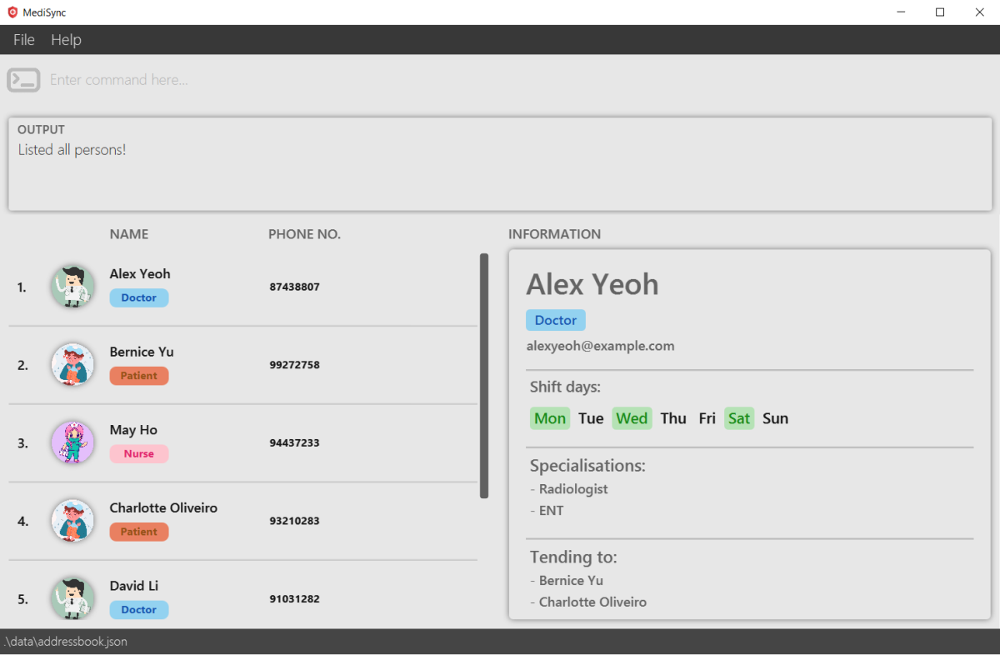
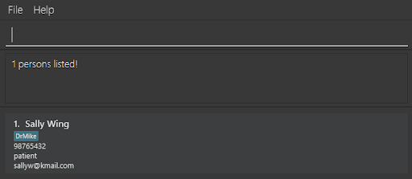

# MediSync User Guide

MediSync is a **desktop app specifically used for head nurses to manage staff and patients, optimised for use via a Command Line Interface** (CLI) while still having the benefits of a Graphical User Interface (GUI). Instead of tracking data of staff and patients using existing applications such as Microsoft Excel, using a CLI-centric application like MediSync will help head nurses track and handle contact management more quickly.

<!-- * Table of Contents -->
<page-nav-print />

--------------------------------------------------------------------------------------------------------------------

## Quick start

1. Ensure you have Java `11` or above installed in your Computer.

1. Download the latest `medisync.jar` from [here](https://github.com/AY2324S1-CS2103-T16-2/tp/releases).

1. Copy the file to the folder you want to use as the _home folder_ for your MediSync.

1. Open a command terminal, `cd` into the folder you put the jar file in, and use the `java -jar medisync.jar` command to run the application. 
   A GUI similar to the below should appear in a few seconds. Note how the app contains some sample data. 
   

1. Type the command in the command box and press Enter to execute it. e.g. typing **`help`** and pressing Enter will open the help window. 
   Some example commands you can try:

   * `list` : Lists all contacts.

   * `add n/John Doe p/98765432 e/johnd@example.com r/patient af/Dr Mike` : Adds a contact named `John Doe` to MediSync.

   * `delete 3` : Deletes the 3rd contact shown in the current list.

   * `clear` : Deletes all contacts.

   * `exit` : Exits the app.

1. Refer to the [Features](#features) below for details of each command.

--------------------------------------------------------------------------------------------------------------------
## Glossary

MediSync strives to streamline the storage and identification of contacts, focusing on essential information that are critical in medical contexts.

Here are some definitions that are noteworthy when using MediSync.

| Term                | Explanation                                                                                                                                                                                                                                                                                                                                                                  |
|---------------------|------------------------------------------------------------------------------------------------------------------------------------------------------------------------------------------------------------------------------------------------------------------------------------------------------------------------------------------------------------------------------|
| Role                | The **role** of a person in the contact list is either `Doctor`, `Nurse`, or `Patient`. When we use the word staff, we are implying both `Doctor`s and `Nurse`s.                                                                                                                                                                                                             |
| Affiliation         | With staff members providing care to specific `Patient`s, there is a need to establish an association between staff members and `Patient`s. We use **affiliations** to denote such relationships. Such relationships can never be one-sided in MediSync, and it will not exist between staff members or between `Patient`s.                                                  |
| Affiliation History | Having some level of history-taking is vital in tracking medical care. The use of **affiliation history** is to track past staff members that had affiliations with a particular `Patient`, and vice-versa. MediSync allows for the deletion of these history, but existing affiliations can never be deleted from the affiliation history until the affiliation is severed. |
| Shift Days          | **Shift days** is an attribute unique to staff members. For simplicity, the current version of MediSync monitors the workdays of each staff member in blocks of days.                                                                                                                                                                                                        |
| Next of Kin         | The **Next of Kin** attribute is meant for `Patient`s. Having a method of contact with the `Patient`s next of kin is vital in medical care.                                                                                                                                                                                                                                  |
| Specialisation      | Exclusively for `Doctor`s, the **specialisation** attribute offers added information about each doctor, enabling the appropriate doctor to be matched with patients having diverse requirements.                                                                                                                                                                             |

--------------------------------------------------------------------------------------------------------------------

## Features

<box type="info" seamless>

**Notes about the command format:** 

* Words in `UPPER_CASE` are the parameters to be supplied by the user. 
  e.g. in `add n/NAME`, `NAME` is a parameter which can be used as `add n/John Doe`.

* Items in square brackets are optional. 
  e.g `n/NAME [a/AFFN_NAME]` can be used as `n/John Doe a/friend` or as `n/John Doe`.

* Items with `…`​ after them can be used multiple times including zero times. 
  e.g. `[a/AFFN_NAME]…​` can be used as ` ` (i.e. 0 times), `a/friend`, `a/friend a/family` etc.

* Parameters can be in any order. 
  e.g. if the command specifies `n/NAME p/PHONE_NUMBER`, `p/PHONE_NUMBER n/NAME` is also acceptable.

* Extraneous parameters for commands that do not take in parameters (such as `help`, `list`, `exit` and `clear`) will be ignored. 
  e.g. if the command specifies `help 123`, it will be interpreted as `help`.

* If you are using a PDF version of this document, be careful when copying and pasting commands that span multiple lines as space characters surrounding line-breaks may be omitted when copied over to the application.

</box>

### Viewing help : `help`

Shows a message explaining how to access the help page.

Format: `help`

### Adding a person: `add`

Adds a contact to the contact list.

Format: `add n/NAME p/PHONE_NUMBER e/EMAIL r/ROLE [a/AFFN_NAME]…​`

* Role can only be listed as `Nurse`, `Doctor`, or `Patient` (case-insensitive).
* Affiliations that are successfully added will update the opposing list of affiliations for the affiliated.

<box type="tip" seamless>

**Tip:** A person can have any number of affiliations (including 0). However, to add an affiliation, it must already exist in the contact list. In addition, the role of the affiliation must be constrasting to the person being added (i.e. affiliations can only be between Nurse and Patient OR Doctor and Patient).

</box>

Examples:
* `add n/John Doe p/98765432 e/johnd@example.com r/patient`
* `add n/May Ho p/97746234 e/may@example.com r/nurse a/John Doe`

### Listing all persons : `list`

Shows a list of all persons in the contact list.

Format: `list`

### Editing a person : `edit`

Edits an existing contact in the contact list.

Format: `edit INDEX [n/NAME] [p/PHONE] [e/EMAIL] [a/AFFN_NAME]…​`

* Edits the person at the specified `INDEX`. The index refers to the index number shown in the displayed person list. The index **must be a positive integer** 1, 2, 3, …​
* At least one of the optional fields must be provided.
* Existing values will be updated to the input values.
* When editing affiliations, the existing affiliations of the person will be removed i.e adding of affiliations is not cumulative.
* You can remove all the person’s affiliations by typing `a/` without
    specifying any affiliations after it.
* Removing all affiliation automatically deletes the person from others' affiliation.

Examples:
*  `edit 3 p/81234567 a/` Edits the phone number of the 3rd person to `81234567` and removes the person’s affiliation
*  `edit 1 n/Sally Wing e/sallyw@kmail.com` Edits the name and the email of the 1st person to `Sally Wing` and `sallyw@kmail.com` respectively.

### Locating persons by attribute: `find`

Finds persons whose specified attribute contains any of the given keywords. Requires a prefix to choose which attribute
to search for.

Format: `find [n/] | [p/] | [e/] | [r/] | [a/]  [KEYWORD] [MORE KEYWORDS]`

* Supports prefixes `n/` for `NAME`, `p/` for `PHONE`, `e/` for `EMAIL`, `r/` for `ROLE`, and `a/` for `AFFILIATION`
* The search is case-insensitive. e.g `hans` will match `Hans`
* The order of the keywords does not matter. e.g. `Hans Bo` will match `Bo Hans`
* Keywords only require a partial match, e.g. `chard` will return `Richard Gramson`
* Persons matching at least one keyword will be returned (i.e. `OR` search).
  e.g. `Hans Bo` will return `Hans Gruber`, `Bo Yang`

Examples:
* `find n/John` returns `john` and `John Doe`
* `find n/sally` returns `Sally Wing` 
  

### Add affiliations of a staff/patient: `addaffn`

Add affiliations to staff/patients indicated by the given `INDEX` without deleting existing affiliation.

Format: `addaffn INDEX a/AFFN_NAME [a/AFFN_NAME]…`

* Add affiliations for the person at the specified `INDEX`.
* The index refers to the index number shown in the displayed person list.
* The index **must be a positive integer** 1, 2, 3, …​
* If person at index is staff, affiliations specified must be a patient.
* If person at index is patient, affiliations specified must be a staff.
* Adding patient A to affiliation of staff B, will result in adding staff B to affiliation of Patient A.
* Multiple affiliations can be added.
* At least one affiliation field must be provided.
* `AFFN_NAME` is specified as full name of a person in the contact list.

Examples:
* `addaffn 1 a/John` add `John` to affiliation of 1st person in the contact list.
* `addaffn 3 a/John a/Mary` add `John` and `Mary` to affiliation of 3rd person in the contact list.

### Returning affiliations of a staff/patient: `affn`

Finds staff/patients who are affiliated with the patient/staff indicated
by the given index.

Format: `affn INDEX`

* Finds affiliations for the person at the specified `INDEX`.
* The index refers to the index number shown in the displayed person list.
* The index **must be a positive integer** 1, 2, 3, …​

Examples:
* `list` followed by `affn 2` lists the people affiliated to the 2nd person in the contact list.
* Subsequently, `affn 1` will list the people affiliated with the 1st person displayed after the previous `affn` command.

### Listing affiliation history of a person: `affnh`

Finds the staff/patients that used to be affiliated or are currently affiliated with the patient/staff indicated by the given index.

Format: `affnh INDEX`

* Finds affiliation history for the person at the specified `INDEX`.
* The index refers to the index number shown in the displayed person list.
* The index **must be a positive integer** 1, 2, 3, …​
* Adding/Editing a person's affiliation automatically updates the affiliation history for the person.

Examples:
* `affnh 2` lists the people who used to be affiliated or are currently affiliated to the 2nd person in the contact list.

### Remove affiliation history of a person: `removeah`

Remove all affiliation history of patient/staff indicated by the given `INDEX`, except for affiliations that are currently affiliated.

Format: `removeah INDEX`

* Remove all affiliation history for the person at the specified `INDEX`.
* The index refers to the index number shown in the displayed person list.
* The index **must be a positive integer** 1, 2, 3, …​
* Does not remove the person they are currently affiliated to from affiliation history.

Examples:
* `removeah 2` remove affiliation history of the 2nd person in the contact list.

### Modifying specialisations of a doctor: `spec`

Finds the doctor indicated by the given index and modifies the specialisations of the doctor.

Format: `spec INDEX`

* Finds the doctor at the specified `INDEX`.
* The index refers to the index number shown in the displayed person list and it must refer to a doctor.
* The index **must be a positive integer** 1, 2, 3, …​
* Specialisations must be separated by a comma.
* To remove all specialisations, type `spec INDEX` without specifying any specialisations after it.

Examples:
* `spec 2 heart, brain` modifies the specialisations of the 2nd doctor in the contact list to `heart` and `brain`.

### Deleting a person : `delete`

Deletes the contact in the contact list.
If the other contacts have affiliations/affiliation history with this contact, the affiliations will be deleted automatically.

Format: `delete INDEX`

* Deletes the person at the specified `INDEX`.
* The index refers to the index number shown in the displayed person list.
* The index **must be a positive integer** 1, 2, 3, …​
* Deleting a person automatically deletes the person from others' affiliation and affiliation history.

Examples:
* `list` followed by `delete 3` deletes the 3rd person in the contact list.
* `find Betsy` followed by `delete 1` deletes the 1st person in the results of the `find` command.

### Add next of kin to a patient: `nok`

Update next of kin of a patient identified at `INDEX` in the contact list.

Format: `nok INDEX [n/NAME p/PHONE rs/RELATIONSHIP]`

* Update next of kin for the person at the specified `INDEX`.
* The index refers to the index number shown in the displayed person list.
* The index **must be a positive integer** 1, 2, 3, …​
* If no optional field provided, next of kin of the person identified at index will be removed.
* `RELATIONSHIP` can be specified in any alphanumeric characters and spaces.

Examples:
* `nok 2` remove next of kin of the 2nd person in the contact list.
* `nok 3 n/John p/11111 rs/Brother` add next of kin with the name `John`, phone `11111` and relationship `Brother` to the 3rd person in the contact list.

### Add shift dates for a staff: `shift`

Updates the shift days of the person identified with the given index number.

Format: `shift INDEX SHIFT_DAYS`

* `SHIFT_DAYS` is in the form of a unbroken string of numbers, from 1 (Monday) to 7 (Sunday), typed with no spaces, e.g. `147` (Monday, Thursday, Sunday).
* The index refers to the index number shown in the displayed person list.
* The index **must be a positive integer** 1, 2, 3, …​

Examples:
* `shift 1 126` will set the 1st person in the contact list's shift days to be Monday, Tuesday, and Saturday.

### Returning staff that are on duty: `onduty`

Finds staff members(doctors/nurses) who are on duty today.

Format: `onduty`

Examples:
* If today is Monday, and `onduty` is called, then staff members that have duty on Monday will be listed.

### Displaying the information of a person : `info`

Displays the information of the person in the contact list.

Format: `info INDEX`

* Displays the information of the person at the specified `INDEX`.
* The index refers to the index number shown in the displayed person list.
* The index **must be a positive integer** 1, 2, 3, …​

Examples:
* `list` followed by `info 3` displays the information of the 3rd person in the contact list.
* `find Betsy` followed by `info 1` displays the information of the 1st person in the results of the `find` command.

### Displaying the information of a person using mouse

Displays the information of the person in the contact list by clicking on the person in the list.

* If clicking is unavailable, you can consider the use of `info` command.

### Traversing the information of persons in the list

Navigate through the information of different people in the displayed list using `UP` and `DOWN` arrow keys.

* The use of `UP` and `DOWN` arrow keys is only applicable when any of the person in the list is highlighted, indicating that the list is on focus.
* Simply clicking on any of the person in the list OR run the `info` command to set the list on focus.

### Clearing all entries : `clear`

Clears all entries from the contact list.

Format: `clear`

### Exiting the program : `exit`

Exits the program.

Format: `exit`

### Saving the data

MediSync data are saved in the hard disk automatically after any command that changes the data. There is no need to save manually.

### Editing the data file

MediSync data are saved automatically as a JSON file `[JAR file location]/data/addressbook.json`. Advanced users are welcome to update data directly by editing that data file.

<box type="warning" seamless>

**Caution:**
If your changes to the data file makes its format invalid, MediSync will discard all data and start with an empty data file at the next run.  Hence, it is recommended to take a backup of the file before editing it.

Be very careful, especially when you modify attributes such as Role, as any mismatch in Affiliations will render the data as invalid e.g. Changing the Role of a Patient to Doctor resulting in this new Doctor having affiliations with another Doctor. Scenarios like these are not exhaustive.

</box>

### Archiving data files `[coming in v2.0]`

_Details coming soon ..._

--------------------------------------------------------------------------------------------------------------------

## FAQ

**Q**: How do I transfer my data to another Computer? 
**A**: Install the app in the other computer and overwrite the empty data file it creates with the file that contains the data of your previous MediSync home folder.

### More FAQ to come

--------------------------------------------------------------------------------------------------------------------

## Known issues

1. **When using multiple screens**, if you move the application to a secondary screen, and later switch to using only the primary screen, the GUI will open off-screen. The remedy is to delete the `preferences.json` file created by the application before running the application again.

--------------------------------------------------------------------------------------------------------------------

## Command summary

| Action                         | Format, Examples                                                                                                                       |
|--------------------------------|----------------------------------------------------------------------------------------------------------------------------------------|
| **Add**                        | `add n/NAME p/PHONE_NUMBER e/EMAIL r/ROLE [a/AFFN_NAME]…​`   e.g., `add n/May Ho p/98765432 e/johnd@example.com r/nurse a/John Doe` |
| **Clear**                      | `clear`                                                                                                                                |
| **Delete**                     | `delete INDEX`  e.g., `delete 3`                                                                                                    |
| **Edit**                       | `edit INDEX [n/NAME] [p/PHONE] [e/EMAIL] [a/AFFN_NAME]…​`  e.g.,`edit 1 p/91234567 e/johndoe@example.com`                           |
| **Find**                       | `find KEYWORD [MORE_KEYWORDS]`  e.g., `find James Jake`                                                                             |
| **List**                       | `list`                                                                                                                                 |
| **List Affiliations**          | `affn INDEX`  e.g., `affn 1`                                                                                                        |
| **List Affiliation History**   | `affnh INDEX`  e.g., `affnh 2`                                                                                                      |
| **Add Affiliations**           | `addaffn INDEX a/AFFN_NAME [a/AFFN_NAME]`  e.g., `addaffn 4 a/Mike Chang a/Tom Cruise`                                              |
| **Modify Shift Days**          | `shift INDEX SHIFT_DAYS`  e.g., `shift 2 1457`                                                                                      |
| **Clears Affiliation History** | `removeah INDEX`  e.g., `removeah 1`                                                                                                |
| **Edit Next of Kin**           | `nok INDEX [n/NAME p/PHONE rs/RELATIONSHIP]`   e.g., `nok 3 n/John p/11111 rs/Brother`                                              |
| **List Staff On Duty**         | `onduty`                                                                                                                               |
| **Modify Specialisation**      | `spec INDEX SPECIALISATIONS`  e.g., `spec 4 Cardiology, Osteology`                                                                  |
| **Display Person Information** | `info INDEX`  e.g., `info 2`                                                                                                        |
| **Help**                       | `help`                                                                                                                                 |
| **Exit**                       | `exit`                                                                                                                                 |
